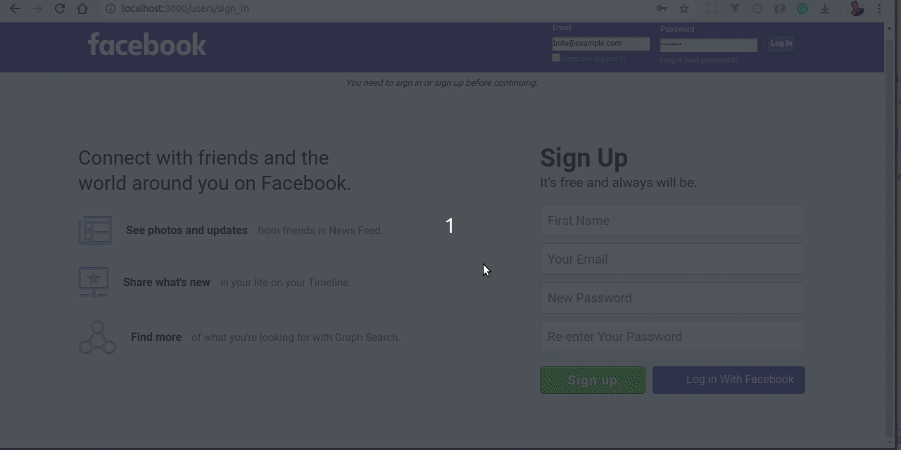

[](https://codeclimate.com/github/bolah2009/facebook-clone/maintainability)
[](https://codeclimate.com/github/bolah2009/facebook-clone/test_coverage)
[](https://travis-ci.org/bolah2009/facebook-clone)
[](https://codecov.io/gh/bolah2009/facebook-clone)

# PROJECT: Facebook Clone

This is the final project of the Main Rails curriculum at [Microverse](https://www.microverse.org/) - @microverseinc

- The objective is to build a facebook clone with core features of the platform – users, profiles, “friending”, posts, news feed, and “liking”. Sign-in with the real Facebook by using Omniauth and Devise is also implemented.

## 🖼️ Screenshot



## [Assignment link](https://www.theodinproject.com/courses/ruby-on-rails/lessons/final-project)

## 🌐 [View in broswer](https://f-b-clone.herokuapp.com/)

## 🛠️ Usage (Development)

### Prerequisites

> Ruby: 2.6.3  
> Rails: 5.2.3

### Clone the repo and run the app.

```
   git clone https://github.com/bolah2009/facebook-clone.git
   cd facebook-clone
   bundle install
   rails db:create
   rails db:migrate
   rspec #run tests
   rails server #run server
   open localhost:3000 on browser
```

### How to run the test suite

- run tests:
  > `rpsec --format documentation`
- view test coverage:
  > `open coverage/index.html`

## 🤝🏾 Contributing

If you are working on adding features, PRs, or bugfixes, this section should help get you going.

1. Fork it
2. Create your feature branch
   > `git checkout -b my-new-feature`
3. Make sure all tests are passing
   > `bundle install`  
   > `rspec`
4. Commit your changes
   > `git commit -am 'Add some feature'`
5. Push to the branch
   > `git push origin my-new-feature`
6. Create new Pull Request

## 👨🏽‍💻 Authors

- [@Torres-ssf](https://github.com/Torres-ssf)
- [@bolah2009](https://github.com/bolah2009/)

## 🧾 TODO

- Fix Rubocop Offense in [rubocop_todo.yml](.rubocop_todo.yml)
- Improve UI/UX

## 🤝 Contributing

Contributions, issues and feature requests are welcome!

Feel free to check the [issues page](../../issues).

## ⭐️ Show your support

Give a ⭐️ if you like this project!

## 🙏🏾 Acknowledgments

- Microverse Team

## 📝 License

[MIT licensed](./LICENSE).
